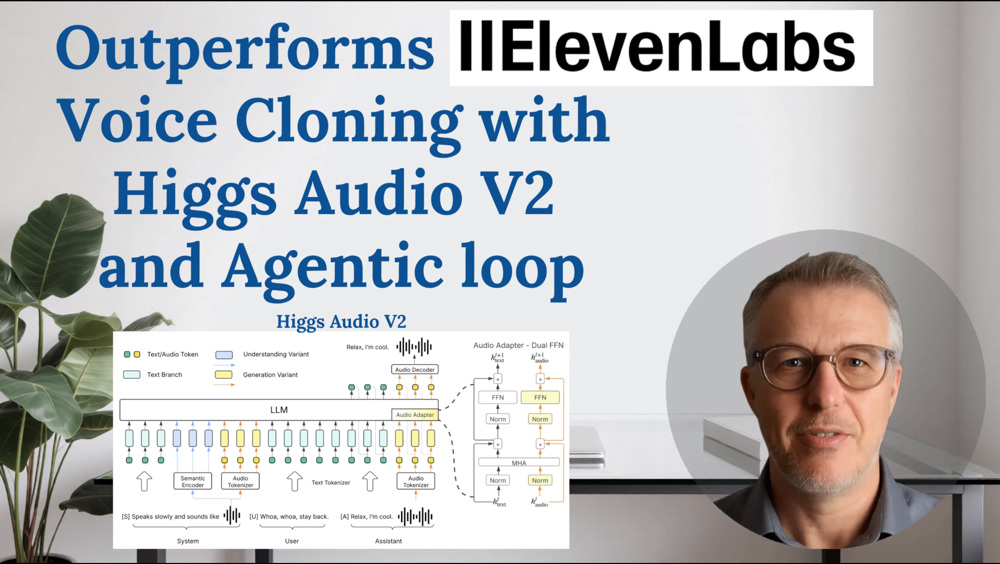

# Agentic Voice Cloning with Higgs Audio V2

Welcome to AgenticVoiceCloning, an open-source framework for high-quality, agentic voice cloning using state-of-the-art AI models. This project demonstrates how to automate and optimize voice cloning with an agentic loop, leveraging multimodal LLMs for evaluation and pitch normalization to outperform commercial solutions.

## Demo Video

Watch the full demo and explanation:

[](https://youtu.be/DZQbsjJaDZg)

## What is Agentic Voice Cloning?

Agentic voice cloning uses an iterative loop to generate, normalize, and evaluate speech samples until the desired quality is reached. The loop includes:

- **Voice Generation**: Uses Higgs Audio V2, a unified LLM-powered audio model, for expressive, consistent, and high-fidelity voice cloning.
- **Pitch Normalization**: Adjusts speech speed and prosody for natural output.
- **Quality Evaluation**: Employs a multimodal LLM (Gemini) to score speech quality against the transcript.
- **Agentic Loop**: Repeats generation and evaluation, adjusting parameters until a high score is achieved.

This approach minimizes human workload and overcomes randomness in transformer-based generation.

## Key Features

- **State-of-the-art open-source model**: Higgs Audio V2 combines a large language model, unified audio tokenizer, and advanced decoder.
- **Agentic loop**: Automates generation, pitch normalization, and quality scoring.
- **Multimodal LLM evaluation**: Uses Gemini via VertexAI for speech quality assessment.
- **GPU acceleration**: Requires a 24GB GPU for optimal performance.
- **GCP integration**: Needs a Google Cloud service account for Gemini API access.

## Requirements

- **Operating System**: Linux Ubuntu 24.04 or later
- **Python Version**: Python 3.12
- **GPU**: NVIDIA GPU with at least 24GB VRAM
- **Google Cloud Service Account**: For Gemini multimodal LLM (VertexAI)

### Ubuntu 24.04, Python 3.12 setup help:
```bash
sudo apt update
sudo apt install -y software-properties-common curl wget build-essential
sudo add-apt-repository ppa:deadsnakes/ppa
sudo apt update
sudo apt install -y python3.12 python3.12-venv python3.12-dev
```

### Ubuntu 24.04, git setup help:
```bash
sudo apt install -y git
git config --global user.name "Your name"
git config --global user.email "your.email@example.com"
```

### Google Cloud Service Account setup:
- Download a service account JSON file from https://cloud.google.com/
- Add your credentials in `.env`:
    ```
    GOOGLE_APPLICATION_CREDENTIALS="./gcp-service-account.json"
    PROJECT_ID="your-gcp-project-id"
    ```

## Environment Variables Setup

Before running the project, you must fill in the `.env` file with your API credentials:

1. **Hugging Face API Key**  
   - Create an account at [Hugging Face](https://huggingface.co/join).
   - Go to your [settings](https://huggingface.co/settings/tokens) and generate a new access token.
   - Add this line to your `.env` file:
     ```
     HUGGINGFACE_API_KEY="your-huggingface-api-key"
     ```

2. **Google Cloud Service Account (Gemini API enabled)**  
   - Create a service account in your [Google Cloud Console](https://console.cloud.google.com/).
   - Enable the Gemini API (VertexAI) for your project.
   - Download the service account JSON file.
   - Add these lines to your `.env` file:
     ```
     GOOGLE_APPLICATION_CREDENTIALS="./gcp-service-account.json"
     PROJECT_ID="your-gcp-project-id"
     ```
   - Make sure your service account has permissions to use Gemini (VertexAI).

## Setup

Clone the repository and run the setup script:

```bash
git clone https://github.com/gdescamps/AgenticVoiceCloning.git
cd AgenticVoiceCloning
./1_setup.sh
```

#### What the setup script does

- Creates a Python 3.12 virtual environment (`venv`)
- Installs all required dependencies
- Installs Higgs Audio V2 and its tokenizer
- Downloads pretrained models and data via DVC (`dvc pull`)

## Usage

### Run the agentic voice cloning loop

To generate a high-quality cloned voice sample:

```bash
python main.py
```

The best generated WAV file will be saved as `./my_voice_cloned.wav`.

### Customize the transcript

Edit the transcript in `main.py` or pass your own text to the agentic loop function.

## Contact

💬 LinkedIn
🔗 https://www.linkedin.com/in/gregory-descamps-05a46b82/


> **Disclaimer:** This repository is for educational and research purposes only. It is not commercial advice. Use at your own risk and only if you fully understand the algorithms and code.

## Citation

If you find this repository helpful, please cite:

```
@misc{agenticvoicecloning2024,
  author       = {Gregory Descamps},
  title        = {Agentic Voice Cloning with Higgs Audio V2},
  year         = {2024},
  howpublished = {\url{https://github.com/gdescamps/AgenticVoiceCloning}},
}
```
